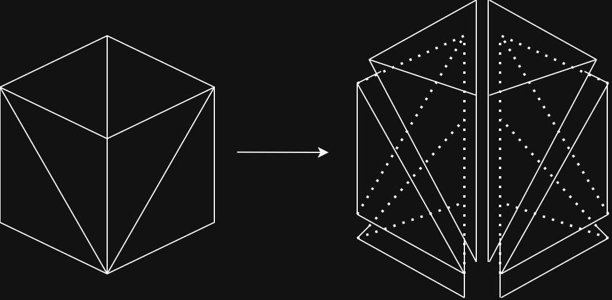

# Manifold Tracing using FK-Triangulation

This repository contains an independent implementation of the Freudenthal–Kuhn triangulation–based manifold tracing algorithm described in the PhD thesis “Meshing Submanifolds using Coxeter Triangulation” by Siargey Kachanovich.

The implementation focuses specifically on tracing co-dimension 1 manifolds, i.e. manifolds of dimension 
$d−1$ embedded in an ambient space of dimension $d$, using a permutahedral representation of the Freudenthal–Kuhn triangulation.

The algorithmic formulation follows the presentation in Kachanovich’s thesis and is conceptually similar to the approach used in the GUDHI library (MIT licensed), but the code in this repository is written from scratch and does not depend on GUDHI.

For a mature and production-ready implementation of the same algorithmic framework, please refer to the
[GUDHI documentation](https://gudhi.inria.fr/doc/latest/)

## Freudenthal-Kuhn triangulation
The Freudenthal-Kuhn triangulation is a a canonical triangulation of the unit cube $[0, 1]^d$ extended periodically to $\mathbb{R}^d$. 

Each unit cube $[y, y + 1]$ where $y \in \mathbb{Z}^d$ is subdivided into $d!$ simplices, one for each permutation $\pi \in S_d$. For a permutation $\pi$, the associated $d$-simplex,

$$
y \rightarrow y + e_{\pi(1)} \rightarrow y + e_{\pi(1)} + e_{\pi(2)} \rightarrow \ldots \rightarrow y + \sum_{i=1}^{d} e_{\pi(i)}

$$

An l-dimensional simplex in a cube is determined by an ordered partition of the set $\{ 1, 2, \ldots, d+1\}$. So for example in $\mathbb{R}^3$ we want to get the 3-dimensional simplex in which the point $(0.6, 0.2, 0.9)$ lies in. Since the ordering of the coordinates is $x_2 < x_1 < x_3$, we get the traversal ordering as 2, 1, 3 and the ordered partition as $\{\{2\}, \{1\}, \{3\}, \{4\}  \}$. 4 acts as the cap - a termination to the tranversal of vertices. Similar if we were to query a 2-dimensional face, the ordered partition would become $\{\{1, 2\}, \{3\}, \{4\} \}$ so $y \rightarrow y + e_1 + e_2 \rightarrow y + e_1 + e_2 + e_3$

## Permutahedral Representation
 Let $\sigma$ be a simplex of some dimensions $l \in \{ 0,\ldots, d\}$ in the Freudenthal-Kuhn triangulation of $\mathbb{R}^d$. There exists a unique vertex $y \in \mathbb{Z}^d$ and a unique ordered partition $\omega$ of $\{ 1, \ldots, d+1\}$ with $d+1 \in \omega(l+1)$ such that $\sigma = \phi(y, \omega)$

Let $y \in \mathbb{Z}^d$ be a vertex in the Freudenthal-Kuhn triangulation of $\mathbb{R}^d$. Let $l \in \{ 0, 1, \ldots, d \}$ and let $\omega$ be an ordered partition of $\{ 1, \ldots, d+1 \}$ in $l+1$ parts such that:
$$
d+1 \in \omega(l+1)
$$
the $l$-dimensional simplex $\sigma(y, \omega)$ is referred to as the permutahedral representation if given as an Eaves notation.

## Data Structure to represent an ambient triangulation
Let $\mathcal{T}$ be a triangulation of $\mathbb{R}^d$ obtained from the Freudenthal-Kuhn Triangulation $\mathcal{T}_0$ of $\mathbb{R}^d$ by a bijective affine transformation $x \mapsto \Lambda x + b$, where $\Lambda \in \mathbb{R}^{d \times d}$ is an invertible matrix and $b \in \mathbb{R}^d$ is the translation vector

The data structuure stores the following:
- The matrix $\Lambda$
- The invertible matrix $\Lambda^{-1}$
- The translation vector $b$

Queries on the data structure:
- The ambient dimension d
- The intrinsic dimensions m of the manifold $\mathcal{M}$
-  The time complexity $M(\Lambda)$ of the multiplication of a vector in $\mathbb{R}^d$ by the matri $\Lambda$
- The time complexity $M(\Lambda^{-1})$ of a vector in $\mathbb{R}^d$ by the matrix $\Lambda^{-1}$

The point location query takes the point $p \in \mathbb{R}^d$ as input gives the permutahedral representation of the simplex $\tau \in \mathcal{T}$ fo the smallest dimension that contains the point $p$. The reverse image $x$ of $p$ under the bijective affine transformation 
$$
x = \Lambda^{-1}(p - b)
$$

## Faces and Cofaces
<u>Set of faces</u>: Let $\tau$ be an $l$-dimensional simplex in the Freudenthal-Kuhn triangulation of $\mathbb{R}^d$ for some $l \in \{ 0, \ldots, d\}$. Let $k \in \{ 0, \ldots, d\}$ ne such that $k \leq l$. We denote by $\text{fac}(\tau, k)$, the set of $k$-dimensional faces of the simplex $\tau$.

<u>Set of cofaces</u>: Let $\tau$ be a $k$-dimensional simplex in the Freudenthal-Kuhn triangulation of $\mathbb{R}^d$ for some $k \in \{ 0, \ldots, d\}. Let $l \in \{ 0, \ldots, d\}$ be such that $k \leq l$. We denote by $\text{cof}(\tau, l)$ the set of $l$-dimensional cofaces of simplex $\tau$ in the Freudenthal-Kuhn triangulation of $\mathbb{R}^d$

### Face Generation Algorithm

Input:
- A record consisting of a vertex $y \in \mathbb{R}^d$ and of an ordered partition $\omega$ of $\{1, \ldots, d+1 \}$ such that $\sigma(y, \omega)$ is the permutahedral representatino of an $l$-dimensional simplex $\tau$ in the Freudenthal-Kuhn triangulation of $\mathbb{R}^d$ for some $l \in  \{ 0, \ldots, d\}$
- An integer $k \in \{ 0, \ldots, d\}$ such that $k \leq l$

There are two aspects to the face genenration algorithm:
- The transition from a k-dimensional face of $\tau$ to the next one. Transition refers to the computation of the internal representation of a k-dimensional face of $\tau$ from the internal representation of the previously computed one.
- The transformation of the internal representation of the $k$-dimensional face of $\tau$ to its permutahedral representation.

The anchor point of k-dimensional face is given as:
$$
y' = v_0 + \sum_{j \in \omega(1)}e_j + \ldots + \sum_{j \in \omega(m_0)}e_j
$$

So the $k$-dimensional face of a $l$-dimensional simplex can be represented as the subset of $k+1$ indices $\{m_0, \ldots, m_k \} \subseteq \{0, 1, \ldots, l \}$. The indices are arranged in the ascending order using a counting sort algorithm (O(l) time complexity) such that $m_0 < m_1 < \ldots < m_k$. After the indices have been sorted, we can use the idea of the permutahedral representation to create a new face. We can define a new ordered partition $\omega'$ as
$$
\omega'(i) = \omega(m_{i-1}+1) \cup \omega(m_{i-1}+2) \cup \ldots \cup \omega(m_i) \\ \forall i \in \{ 1, 2, \ldots k \} \\
\omega'(k+1) = (\omega(1) \cup \ldots \cup \omega(m_0))\cup(\omega(m_k + 1) \cup \ldots \cup \omega(l+1))
$$

Lets take an example for a 2d triangle given by the ordered partition $\omega = \{\{0\}, \{1\}, \{2\}\}$ so the all the possible subset of $m$ indices would be $\{0, 1\}, \{1, 2\}, \{0, 2\}$ so the ordered partitions would be (here k = 1)

$$
m_0 = 0, m_1 = 1\\
\omega' = \{\omega(1)\}, \{(\varnothing)\cup(\omega(2)\cup\omega(3))\} = \{0\},\{1, 2\}\\
m_0 = 1, m_1 = 2\\
\omega' = \{\omega(2)\}, \{(\omega(1))\cup(\omega(3))\} = \{1\},\{0, 2\}\\
m_0 = 0, m_1 = 2\\
\omega' = \{\omega(1) \cup \omega(2)\}, \{(\varnothing)\cup(\omega(3))\} = \{0, 1\},\{2\}
$$

### Coface Generation Algorithm
Input:
- A record consisting of a vertex $y \in \mathbb{Z}^d$ and an ordered partition $\omega$ of $\{1, \ldots, d+1\}$ in $k+1$ parts such that $\sigma(y, \omega)$ is the permutahedral representation of a k-dimensional simplex $\tau$ in the Freudenthal-Kuhn Triangulation of $\mathbb{R}^d$, for some $k \in \{0, \ldots, d\}$
- An integer $l \in \{ 0, \ldots, d\}$ such that $l \geq k$

The generated $l$-dimensional cofaces are represented in the following way. All the cofaces of $\tau$  share the vertex $y$. Therefore all the simplices in $\text{cof}(\tau, l)$ that coface generation algorithm generates lie in $\text{star}(y)$

_The star of a simplex $\sigma$ in the cell complex is the set of all its cofaces in $\mathcal{K}$. The closed star is the minimal polytope that contains the star_

Each simplex $\tau'$ in $\text{cof}(\tau)$ is in one-to-one correspondence with a refinement $\rho$ of the input ordered partition $\omega$ into $l+1$ parts. The refinement $\rho$ is encoded using a record $(a, \rho_1, \ldots, \rho_{k+1})$

- An integer composition $a = a_1, \ldots, a_{k+1}$ of $l+1$ in $k+1$ terms. Each $a_i$ is at most cardinality $|\omega(i)|$ and represents the number of subparts in which we need to subdivide $\omega(i)$ to obtain the corresponding parts in the refinement $\rho$

- Refinements $\rho_1, \ldots \rho_{k+1}$ of $\omega(1), \ldots \omega(k+1)$ into $a_1, \ldots, a_{k+1}$ parts respectively. Each refinement $\rho_i$ represents the specific way to subdivide $\omega(i)$ to obtain the corresponding parts in the refinement $\rho$. So forexample we have a $\omega(1) = \{ 3,4,5 \}$ so the possible values of $a_1 = 1, 2, 3$ since it is bounded by $|\omega(1)|$ i.e. $a_1 \leq 3$. Let us say $a_1 = 2$ then the possible ordered partition for $\rho_1$ are

Unordered Partition possibility 1:
$$
\rho_1 = \{ 3,4\}, \{5 \} \\
\rho_1 = \{ 5\}, \{3, 4 \}
$$
Unordered Partition possibility 2:
$$
\rho_1 = \{ 3,5\}, \{4 \} \\
\rho_1 = \{ 4\}, \{3, 5 \} \\
$$
Unordered Partition possibility 3:
$$
\rho_1 = \{ 4, 5\}, \{3 \} \\
\rho_1 = \{ 3\}, \{4, 5 \} \\
$$

The integer composition $a$ of $l+1$ in $k+1$ terms bounded $|\omega(1)|, |\omega(2)|, \ldots, |\omega(k+1)|$ are generated by a **Walsh Algorithm**. We also generate the ordered partitions $\rho_1, \rho_2, \ldots, \rho_{k+1}$. We do this by storing the unordered partition $\hat{\rho}_1, \hat{\rho}_2, \ldots, \hat{\rho}_{k+1}$ and then to generate the ordered partition, we take every possible permutation represented as $\sigma_i : \{ 1, \ldots, a_i\} \rightarrow \{ 1, \ldots, a_i\}$. The unorederd partitions are generated using the **Rusky Savage algorithm** and the permutations are generated using **Ehrlich algorithm**.

There are few steps to the coface generation from the given simplex:

- Initialization: First using the Walsh we initialize $a$ since the refinement sizes  depend on it. After that we initialize the refinements in any order. For example, l = 3, k = 1, for d = 5 with $\omega = \{\{1, 2\}, \{0, 3, 4, 5\}\}$. Lets say $a$ is intialized to $a = \{2, 2\}$ and $\rho_1 = \{1\}, \{2\}$ and $\rho_2 = \{0, 3\}, \{4, 5\}$

- Transition algorithm: An l-dimensional coface of $\tau$ is stored as a record ($a, \rho_1, \rho_2, \ldots, \rho_{k+1}$). To make a transition from one l-dimensional coface to another, the entries are updated in the reverse order from the initialization $\rho_{k+1}, \ldots, \rho_1, a$. If all the entries have the finals values of the respective generations for $\rho_i$ and $a$ then the corrsponding l-dimensional coface is the final one. If they have not reached the final ones then the transition happens in the following manner taking the left-most entry in the reversed list.

    - If the entry $o$ is not $a$, then update $o$ to its next value. This means that $o = \rho_i$ for $i \in \{1, \ldots, k+1 \}$. Then reinitialize all the refinements to the left of $\rho_{k+1}, \ldots, \rho_{i+1}$ to the original initialized values

    - If the entry $o$ is $a$ then the algorithm updates $a$ to the next value given as per the Walsh algorithm. The entries $\rho_1, \rho_2, \ldots, \rho_{k+1}$ are reinitialized to the first values in their respective generation algorithsm

- Transformation algorithm: The transformation converts the records to represent the permutahedral format. 
    - The record is first transformed to the Eaves notation $\phi(y, \rho)$ of $\tau'$ such that - the vertex $y$ is the same as in the input and $\rho$ is some refinement of $\omega$ in $l+1$ parts. So $\rho$ is simply the concatenation of the refinements $\rho_1, \ldots, \rho_n$

    - From $y$ and $\rho$, a new vertex $y'$ and a new partition $\rho'$ is found such that $\sigma(y', \rho')$ is the permutahedral representation of $\tau'$. The permutahedral representation $\sigma(y, \rho)$ is obtained my rotating the order of the refinements such that the partitions containing the $d+1$ element is at the end. Lets say after rotation we get the ordering as $\rho(t+1), \ldots, \rho(l+1), \rho(1), \ldots, \rho(t)$ so $\rho = \rho(1) \cup \ldots \cup \rho(t)$ then $y'$ is given by 
    $$
        y' = y + \sum_{i \in \rho}e_{i}
    $$

## Manifold Tracing
Once we have the coxeter triangulation, the manifold tracing is trivial.  Let's say we want to trace an m-dimensional manifold $\mathcal{M}$ embedded in $\mathbb{R}^d$ Tracing the manifold simply becomes the work of treating the FK-triangulation as a graph structure and performing a BFS traversal to find all the k-m dimensional simplices that intersect with the $\mathcal{M}$.

Algorithm: Manifold Tracing:

input: Triangulation $\mathcal{T}$ of $\mathbb{R}^d$ which is identical to the Freudenthal-Kuhn triangulation $\mathcal{T}_0$ of $\mathbb{R}^d$ up to an affine transformation, manifold $\mathcal{M}$ of dimension m, seed point $x_0 \in \mathcal{M}$

output: Set $S$ of the simplicies in $\mathcal{T}$ of dimension $k = d - m$ that intersect $\mathcal{M}$

1. Translate $\mathcal{T}$ so that $x_0$ coincides with the barycenter of a k-dimensional face $\tau_0$ 

2. 

## Acknowledgements
I would like to thank Prof. Antony Thomas (Proffesor at RRC IIIT Hyderabad) and Dr. Siargey Kachanovich for their inputs and their support for making this implementation possible